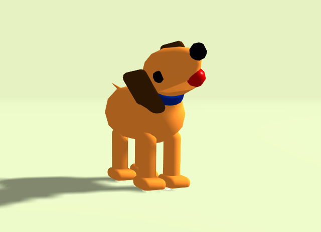

# teach-dog-a-trick

## <a href="https://pablolucianop.github.io/teach-dog-a-trick/index.html" target="_blank" rel="noopener noreferrer">DEMO</a>

Anyone interested in adding something to a small project? I'm looking to gain some experience in collaborative work and git in general.
This is my proposition: Teach this dog a trick!

I have built a simple 3D model of a dog. You can join in, teach the dog do something new: roll over when a button is pressed. Close eyes when the cursor passes through the forehead. Teach him to help you evade taxes, etc...

Two redditors have already contributed! Brianpeiris teach the dog how to play fetch, and leogardiner to play dead.
I have edited the code so it's easier to read.

Contact me or just fork this repository, add some code and I will merge it!

## Built With

-   [Three.js](https://threejs.org/) - three.js – JavaScript 3D library
-   [3DS MAX](https://www.autodesk.com/products/3ds-max) - 3Ds Max – 3D modeling and rendering software for design visualization, games, and animation

## Contributors

-   [pablolucianop](https://github.com/pablolucianop) - **Model the dog** and set the bases

-   [brianpeiris](https://github.com/brianpeiris) - Though the dog to **play fetch**

-   [leogardiner](https://github.com/leogardiner) - Though the dog to **play dead**  

-   [pfeinberg](https://github.com/pfeinberg) - **Give the dog a park to run**, and tought to **come when called**  

Feel free to play with him! Just remember, he is a little rebellious!
